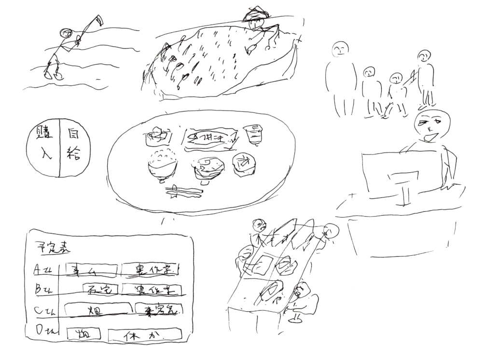

# hotsoul-philosophy
株式会社ホットソウルの企業理念をつくる  

本プロジェクトに対する想いを、こちらのコラムにつづっております。  
宜しければ、ご一読のほど、お願い致します。  
[企業理念について](https://www.hotsoul.jp/column/about-our-corporate-philosophy/)
  

## Vision - 私たちは将来、どんな景色をつくり出したいか？
- 無理をしない「半農半Ｘ」生活
- 食卓の半分以上を「手作り」に

### ビジョンスケッチ - 「最高にワクワクする未来の景色」   


```
毎日の食卓には、質素だが健康的で栄養価の高い、ある意味で贅沢な品々が並ぶ。その半分以上は、自分達で手作りしたものか、知り合いの方からの頂き物だ。
日常生活の一部として、それぞれが無理のない範囲で楽しみながら農作業をしている。あまり費用をかけないようにする為、機械の導入は最低限にして、肥料や病害虫の防除も身近に手に入るもので工夫している。
それぞれの家族も、誰かが何かを極端に我慢する必要はなく、伸び伸びと楽しく過ごせている。
ひとたび農場を離れれば、それぞれが得意なところを活かして協力し、営利を目的とする株式会社として、お金を稼ぐことを妥協はしない。
物質的な豊かさと精神的な豊かさ、便利な道具と健康的な強い体、全てがほどよく整うところを妥協無く目指し、一日一日を精一杯生きていく。
```

### ビジョンの実現に向けて最初に目指すところは？
会社で農地を借り、福利厚生の一環として農作業を楽しみ、また収穫した作物を分け合って楽しめるような、働き方や社内制度、体制、新しい事業の仕組みをつくる。同時にそのような目標に共感する人を集め、ホットソウルの仲間になってもらう。


## 参考図書

項番|書名|著者|発行
----|----|----|----
1|常識をくつがえせ！小さいは、強い　町の電気屋VS巨大量販店　1450日の攻防|江藤 健続|株式会社フローラル出版
2|理念経営2.0　会社の「理想と戦略」をつなぐ7つのステップ|佐宗 邦威|ダイアモンド社
